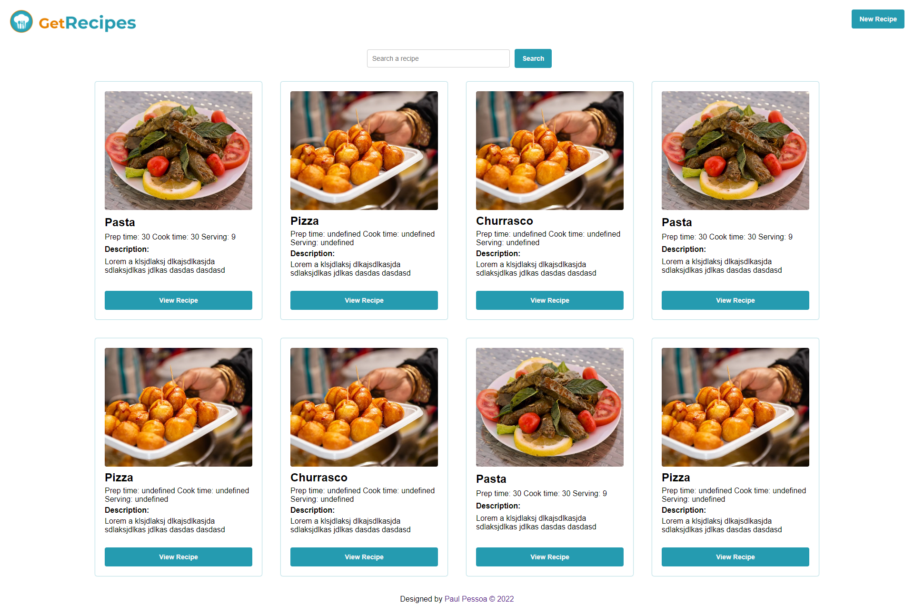

# GetRecipes

[>>>>>  INSTALATION FILE HERE  <<<<<](./INSTALATION.md)

### Home (Page)

<b>Cabeçalho:</b>
- [x]  Logo (img)
- [x]  Adicionar Receitas (button)

<b>Barra de Pesquisa</b>
- [x] Buscar receitas (input)
- [x] Pesquisar (button)

<b>Cards de Receitas:</b>
- [x] Título da Receita (h2)	
- [x] Imagem da Comida (img)
- [x] Tempo de preparo (icon + span) 
- [x] Porções (icon + span)
- [x] Resumo (p)
- [x] Ver receita (button)

<b> Receita:</b> (Page)
- [ ] Voltar (button)
- [ ] Titulo da receita (h2)
- [ ] Imagem da receita (img)
- [ ] Descrição (p)
- [ ] Ingredientes (ul)
- [ ] Metodo de preparo (ul)
- [ ] Botões de compartilhar (icon)

<b>Nova Receita:</b> (Form)
- [ ] Campo Titulo da receita (input)
- [ ] Imagem da Comida (input)
- [ ] Resumo (input)
- [ ] Porções (input)
- [ ] Tempo de preparo (input)
- [ ] Ingredientes (input)
- [ ] Adicionar Ingrediente (button)
- [ ] Modo de preparo (input)
- [ ] Adicionar Etapa  (button)

- [ ] Salvar (button)
- [ ] Cancelar  (button)

<b>Rodapé:</b>
- [x]  Créditos (p)
